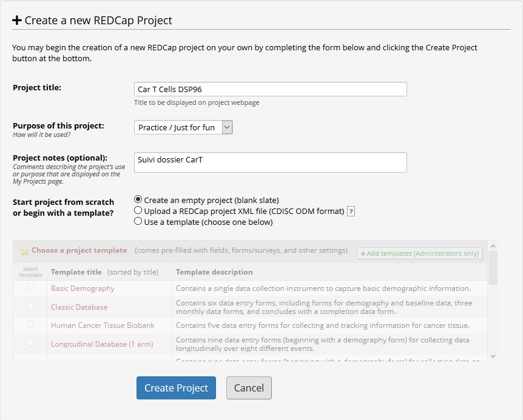
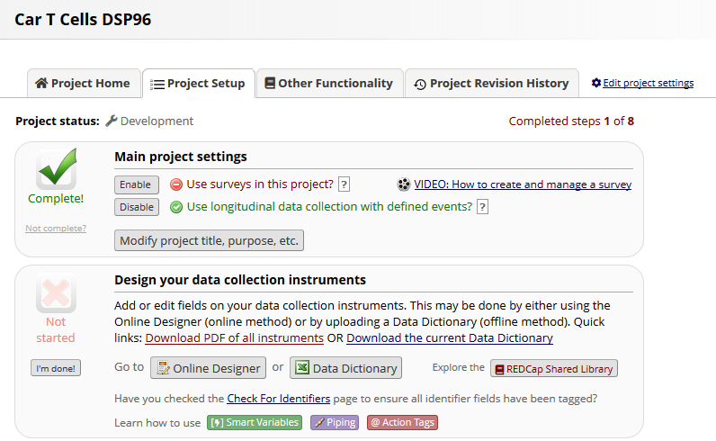
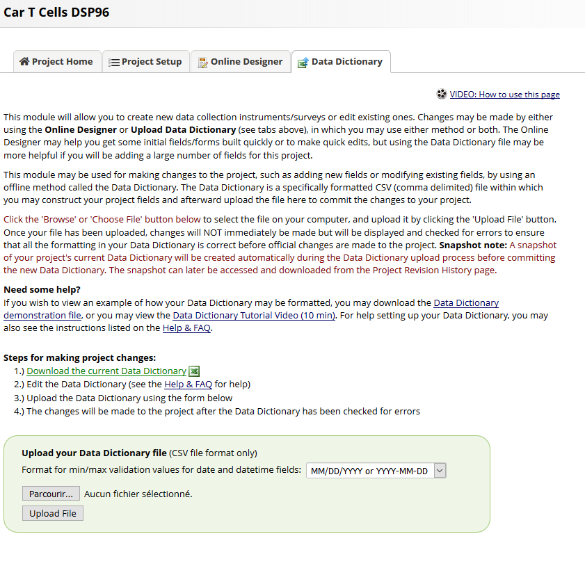
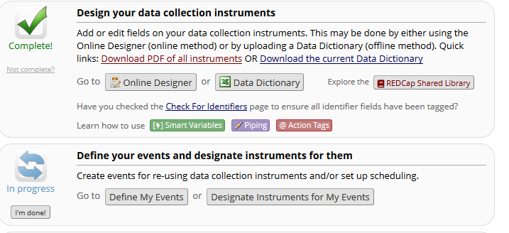
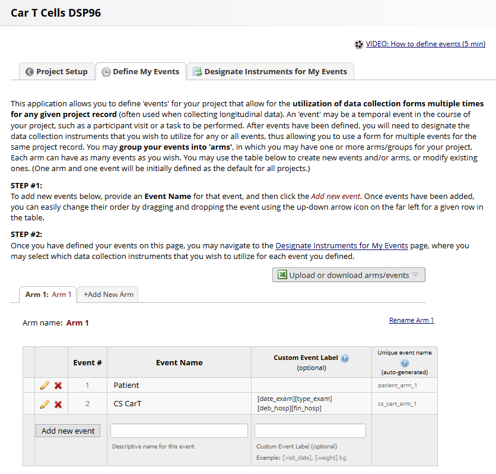
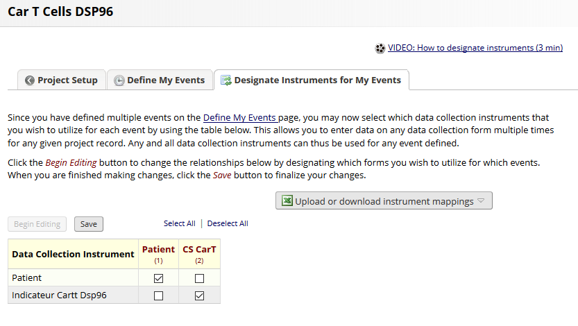
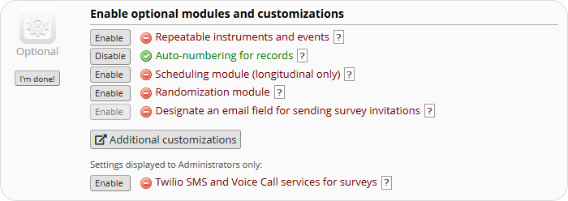
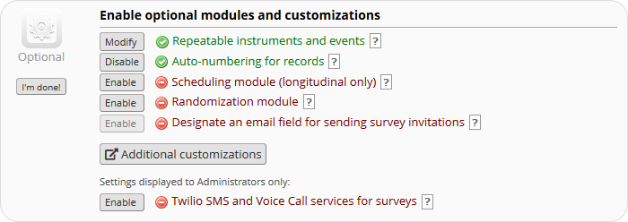
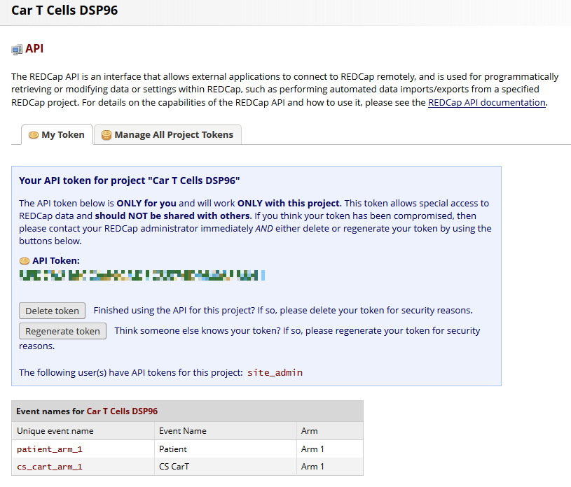

mc2 - ETL MiddleCare
===============================================================================

Ce projet a pour objectif de faciliter l'extraction et l'exploitation des données des Dossiers de Service (DSP) du logiciel **MiddleCare** via une suite d'outils en ligne de commande (développée en PHP).  

Parmi les données extractibles, une distinction est faite entre le **dictionnaire** des variables disponibles dans un DSP (= la structure des formulaires MiddleCare) et les **valeurs** que prennent ces variables à chaque édition d'un document via les formulaires MiddleCare.

L'ensemble de ces données peut être enregistré au format **CSV**, dans une base de données **MySQL** ou dans un projet **RedCap**.

**Note importante :**

Afin de ne pas solliciter inutilement la base de production de MiddleCare, il est conseillé de récupèrer l'ensemble des données d'un DSP dans une base de donnée MySQL (par exemple la nuit, automatiquement et périodiquement) puis d'extraire de cette base les données voulues sous forme de fichiers CSV ou de projet RedCap.  

Ce document fourni des exemples de chacune de ces étapes ainsi qu'un exemple complet de chargement d'un DSP MiddleCare vers un projet RedCap.


Prérequis  
===============================================================================
- PHP 5.3 + OCI8
- Composer
- MySQL
- Optionnellement : 
  - projet RedCap avec API Key


Installation
===============================================================================

- Copier le contenu de ce dossier sur un serveur avec PHP
- Si le dossier des dépendances (vendor) est vide :
```bash
composer install
```

- Créer les fichiers de configuration à partir des fichiers template puis configurer les connexions aux bases MiddleCare, mc2 et à l'API RedCap dans les fichiers yml correspondants
```bash
cd config
cp config_db_middlecare.default config_db_middlecare.yml
cp config_db_mc2.default config_db_mc2.yml
cp config_redcap.default config_redcap.yml
cd ..
```

- Vérifier la configuration et les accès aux bases de données
```bash
php install/mc2_install.php --check
```

- Créer les tables de la base mc2
```bash
php install/mc2_install.php --install
```


Usage 
===============================================================================

Avant toute extraction à destination d'un projet RedCap, il est conseillé de rassembler les informations suivantes:  

- **Site** : le trigramme du site du DSP = sls ou lrb 

- **DSP_ID** : l'identifiant MiddleCare du DSP, ex: Sénologie = DSP2 (cf extraction de la liste des DSP existants)

- **Période** : les dates de début et de fin (non incluse) de l'extraction au format AAAAMMJJ,  ex: Année 2018 = [début : 20180101, fin : 20190101]

- **Liste des variables à intégrer dans RedCap** : un projet RedCap n'étant pas voué à intégrer la totalité des variables d'un DSP (parfois plus de 600 variables par document, dont du texte libre), il est nécessaire d'en faire une sélection pertinente à partir du dictionnaire des variables d'un DSP MiddleCare (cf. extraction d'un dictionnaire d'un DSP). 


Extraction MiddleCare vers base de données MySQL
-------------------------------------------------------------------------------

```bash
# aide / man
php bin/mc2_mc_to_db.php

# extraire la liste des DSP existants
php bin/mc2_mc_to_db.php --site sls --dict

# extraire le dictionnaire d'un DSP
php bin/mc2_mc_to_db.php --site sls --dict --dsp DSP2

# extraire l'ensemble des données d'un DSP pour une période donnée
php bin/mc2_mc_to_csv.php --site sls --dsp DSP2 --deb 20180101 --fin 20190101
```

Extraction base de données MySQL vers fichier CSV
-------------------------------------------------------------------------------

```bash
# aide / man
php bin/mc2_db_to_csv.php

# extraire la liste des DSP existants
php bin/mc2_db_to_csv.php --site sls --dict

# extraire le dictionnaire d'un DSP vers fichier CSV 'Excel friendly'
php bin/mc2_db_to_csv.php --site sls --dict --dsp DSP2 --excel

# extraire le dictionnaire d'un DSP, avec filtrage des variables
php bin/mc2_db_to_csv.php --site sls --dict --dsp DSP2 --items "VAR1 VAR2 DEB_HOSP"

# extraire l'ensemble des données d'un DSP pour une période donnée, avec filtre sur le type de document
php bin/mc2_db_to_csv.php --site sls --dsp DSP2 --deb 20180101 --fin 20190101 --type_doc 'Cs sénologie de surveillance'

# extraire l'ensemble des données d'un DSP pour une période donnée, avec filtrage des variables et vers fichier 'Excel friendly'
php bin/mc2_db_to_csv.php --site sls --dsp DSP2 --deb 20180101 --fin 20190101 --excel
```

Extraction base de données MySQL vers projet RedCap
-------------------------------------------------------------------------------

```bash
# aide / man
php bin/mc2_db_to_rc.php

# extraire le dictionnaire d'un DSP vers fichier CSV RedCap (Note : pour ouverture avec Excel = --excel)
php bin/mc2_db_to_rc.php --site sls --dict --dsp DSP2 

# extraire le dictionnaire d'un DSP, avec filtrage des variables
php bin/mc2_db_to_rc.php --site sls --dict --dsp DSP2 --items "VAR1 VAR2 DEB_HOSP"

# extraire les données d'un DSP pour une période donnée, avec filtrage des variables et vers projet RedCap (longitudinal) existant (API Key du projet dans config_redcap.yml )
php bin/mc2_db_to_rc.php --site sls --dsp DSP2 --deb 20180101 --fin 20190101 --long --inst_only --inst "Indicateur CarT" --items "VAR1 VAR2 DEB_HOSP"
```

Extraction MiddleCare vers fichier CSV 
-------------------------------------------------------------------------------

```bash
# aide / man
php bin/mc2_mc_to_csv.php

# extraire la liste des DSP existants
php bin/mc2_mc_to_csv.php --site sls --dict

# extraire le dictionnaire d'un DSP vers fichier CSV 'Excel friendly'
php bin/mc2_mc_to_csv.php --site sls --dict --dsp DSP2 --excel

# extraire le dictionnaire d'un DSP, avec filtrage des variables
php bin/mc2_mc_to_csv.php --site sls --dict --dsp DSP2 --items "VAR1 VAR2 DEB_HOSP"

# extraire les données d'un DSP pour une période donnée
php bin/mc2_mc_to_csv.php --site sls --dsp DSP2 --deb 20180101 --fin 20190101

# extraire les données d'un DSP pour une période donnée, avec filtrage des variables et vers fichier 'Excel friendly'
php bin/mc2_mc_to_csv.php --site sls --dsp DSP2 --deb 20180101 --fin 20190101 --excel
```

Exemple complet - Extraction des données d'un DSP MiddleCare vers projet RedCap
-------------------------------------------------------------------------------

L'exemple suivant illustre l'extraction d'un ensemble de variables choisies du DSP de "suivi de CarTCell" (DSP96) sur l'année 2018 vers un projet RedCap.

1 - Récuperer le dictionnaire dans la base MYSQL et sous forme de fichier CSV (pour sélection des variables à intégrer dans le projet RedCap)  

```bash
php bin/mc2_mc_to_db.php --site sls --dict --dsp DSP96
php bin/mc2_db_to_csv.php --site sls --dict --dsp DSP96 --excel
```

2 - Charger les valeurs des variables dans la base MYSQL pour la période voulue

```bash
php bin/mc2_mc_to_db.php --site sls --dsp DSP96 --deb 20180101 --fin 20190101
```

3 - Génerer data dictionnary pour projet RedCap longitudinal avec les variables (--items) selectionnées

```bash
php bin/mc2_db_to_rc.php --site sls --dict --dsp DSP96 --long --inst 'Indicateur CartT DSP96' --inst_only --items 'DEB_HOSP FIN_HOSP UH VAR1 VAR2'
```

4 - Créer projet RedCap 



5 - Main project Settings : Enable "Use Longitudinal data collection with defined events" puis uploader data dictionnary précédent





6 - Définir les events et désigner les instruments associés puis les renseigner dans config_redcap.yml

```yml
# config_redcap.yml
redcap:
    ...
    # Longitudinal project events
    shared_event_name: 'Patient'
    shared_event_custom_label: ''
    repeatable_event_name: 'CS CarT'
    repeatable_event_custom_label: '[date_exam][type_exam][deb_hosp][fin_hosp]'
```








7 - Dans Enable optionnal modules and customizations : Enable "Repeatable instruments and events"







8 - Générer API Token puis l'ajouter dans config_redcap.yml (Applications > API)



```yml
# config_redcap.yml
redcap:
    ...
    api_token: '12345678978798754656465465465'
    ...
```

7 - Charger les données de la période voulue dans le projet RedCap

```bash
php bin/mc2_db_to_rc.php --dsp DSP96 --deb 20180101 --fin 20190101 --long --inst_only --inst 'Indicateur CartT DSP96' --items 'DEB_HOSP FIN_HOSP UH VAR1 VAR2'
```

8 - Profit !

TODO 
===============================================================================

- refactoring : tables OMOP friendly
- mc2_db_to_rc : supprimer les balises HTML des textes libres
- doc : Ajouter CSV anonymisés d'exemple à l'annexe Format CSV


Annexe - Arborescence
===============================================================================

```yml
/bin            # [MAIN] scripts PHP CLI
/config         # configuration DB MiddleCare (config_db_middlecare.yml), DB Locale (config_db_mc2.yml) et RedCap (config_redcap.yml)
/data           # fichiers output
/docs           # documentation
/install        # script PHP CLI d'installation de la DB Locale
/log            # Logs
/src            # code source PHP
/tests          # tests 
/vendor         # dépendances PHP (si vide > composer install)
composer.lock   
composer.json    
README.md       
```

Annexe - schéma bases de données MySQL
===============================================================================


Annexe - formats CSV
===============================================================================

CSV Dictionnaire & Données
----------------------------

**Dictionnaire :**

Exemple de CSV : (lien dl)

Colonne | Définition | Exemple
--------| ---------- | --------
dossier_id | Identifiant du DSP | "DSP2"
page_nom | Nom de la page | "CHAPITRE46"
page_libelle | Libellé de la page | "Prescriptions et conclusion"
bloc_no | Numéro de bloc |
bloc_libelle | Libellé du bloc | "Antécédents obstétricaux"
ligne | Numéro de ligne  |
item_id | Identifiant de la variable / de l'item | "VAR1240"
type | Type (Oracle) de la variable (dans la base MiddleCare) | VARCHAR2, CLOB, NUMBER ...
mctype | Type (MiddleCare) de la variable | TXT (petit texte), BT (long texte / champs libre), LD (liste déroulante), LDM (liste à choix multiple), BAC (bool)
libelle | Libellé de la variable | "Conclusion IRM"
libelle_bloc | Libellé alternatif de la variable (dans un bloc) | "IRM"
libelle_secondaire | Libellé alternatif de la variable | "IRm cs en cours de ttt"
detail | Nom de la page ou de la fiche contenant plus de détail | "FICHE4"
type_controle | Type de controle | Prend la valeur "CALCUL" dans le cas d'une variable calculée automatiquement 
formule | Formule pour variable calculée automatiquement | Pour la variable "IMC" : var1476/puissance( var1477*0.01,2) (où var1476 est le poids et var1477 est la taille en cm)
options | Options | D_CALENDAR si type DATE
list_nom | Identifiant de la liste  | "DSP2_LST85"
list_values | Valeurs de la liste | 1, \|2, OUI\|3, NON

**Données :**

Le fichier CSV de données contient une ligne par document. 
La ligne 0 contient les noms des colonnes / variables. 
Les lignes 1 à 4 contiennent :
- ligne 1 : Libellé de la variable
- ligne 2 : Libellé de la page à laquelle appartient la variable dans le DSP
- ligne 3 : Type (MiddleCare) de la variable
- ligne 4 : Valeurs possibles si variable de type liste / à choix multiple (au format RedCap: "1, [valeur1]|2, [valeur2]|3, [valeur3]...").

Les premières colonnes sont toujours présentes quelque soit le DSP.
Elles contiennent : 
- les informations générales du patient (nom, prénom, ddn, sexe...)
- les informations du patient à la date de création du document (age, poids, taille...)
- les informations sur le document (type, dates de creation / modification, opérateur de saisie, version)

Exemple de CSV : (lien dl)

Colonne | Définition | Exemple
--------| ---------- | --------
nipro | Identifiant du document | 180000000000
ipp | IPP (patient) | 8000000000
nip | NIP (patient) | 1000000000
nom | Nom (patient) | ABITBOL
prenom | Prénom (patient) | GEORGE
datnai | Date de naissance (patient) au format JJ/MM/AAAA| 01/01/1970
sexe | Sexe (patient)| masculin/féminin
type_exam | Type de document | "CR HDJ Sénologie"
venue | N° de Venue. NDA (= 9 chiffres) ou numéro de CS (>9 chiffres)| 760000000
age | Age du patient à la date du document | 60
poids | Poids (kg) du patient à la date du document | 70
taille | Taille (cm) du patient à la date du document | 180
date_exam | Date de l'examen / de la consultation / de la création du document au format JJ/MM/AAAA | 01/01/2019
date_maj | Date de la dernière mise à jour du document au format JJ/MM/AAAA | 02/01/2019
oper | Identifiant du dernier utilisateur à avoir modifié le document (APH?) | 4087281
revision | Version | 12
extension | Extension du document généré | ".pdf"
var1710 | variable du DSP |
var1637 | variable du DSP |
deb_hosp | variable du DSP |
fin_hosp | variable du DSP|
uh | variable du DSP |
... | etc |

CSV RedCap (Dictionnaire + Données)
----------------------------

Voir documentation REDCAP.  

Exemples : 
- TODO ajouter CSV dictionnaire RedCap d'exemple
- TODO ajout CSV données (long | flat) d'exemple


Annexe - Documentation 
===============================================================================

RedCap :
- Infrastructure Requirements: 
    - https://projectredcap.org/wp-content/resources/REDCapTechnicalOverview.pdf
- API :
    - https://cran.r-project.org/web/packages/REDCapR/vignettes/TroubleshootingApiCalls.html
