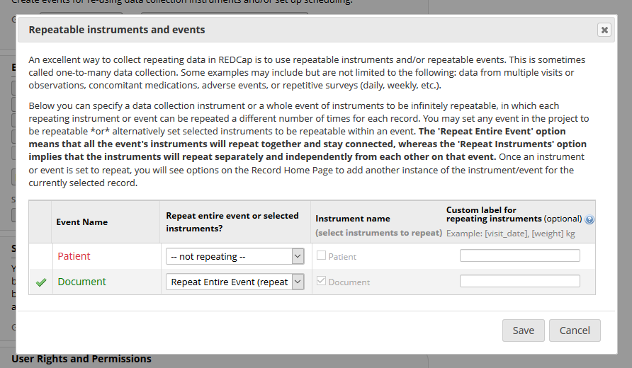
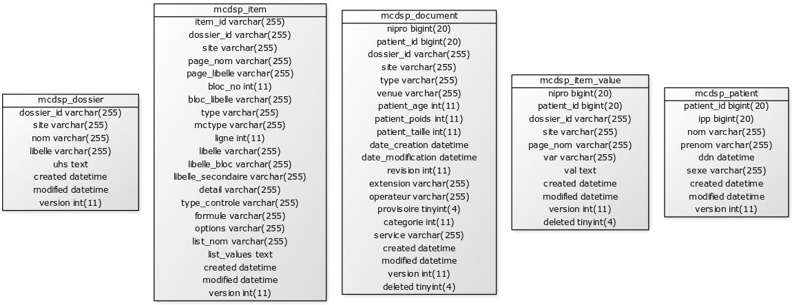

mc2 - ETL MiddleCare
===============================================================================

mc2 a pour objectif d'automatiser l'extraction des données du Dossier Patient Informatisé (DPI) **MiddleCare** via une suite d'outils en ligne de commande (développée en PHP). Seuls les dossiers structurés (Dossiers de Service (DSP)) de l'application  sont extractibles. L'application propose en outre différents formats de persistance dans une base de données ou d'export pour faciliter l'exploitation des données.

L'extraction est réalisée en 2 temps:
- une première fonction permet l'extraction du **dictionnaire** des variables disponibles dans un DSP (= la structure des formulaires MiddleCare)
- une seconde permet l'extraction des **valeurs** de ces variables telles qu'elles sont renseignées dans les formulaires.

L'ensemble de ces données peut être enregistré au format **CSV**, dans une base de données **MySQL** ou dans un projet **RedCap**.

**Note importante :**

Afin de ne pas solliciter inutilement la base de production de MiddleCare, il est conseillé  d'extraire les données d'un DSP dans une base de donnée MySQL (par exemple la nuit, automatiquement et périodiquement) puis d'exporter de cette base les données d'intérêt dans un fichiers CSV ou un projet RedCap.  

Ce document fourni des exemples de chacune de ces étapes permettant l'extraction d'un DSP ainsi qu'un exemple complet de chargement d'un DSP MiddleCare vers un projet RedCap.

Prérequis  
===============================================================================
- DPI **MiddleCare**
- PHP 5.3 + OCI8
- Composer
- MySQL
- Optionnellement : 
  - projet RedCap avec API Key

NB : mc2 a été développé de façon a pouvoir interroger plusieurs instances de bases de données **MiddleCare** (par exemple dans le cadre d'un groupe hospitalier composé de plusieurs établissements). Chaque instance est indentifiée par une variable **Site** .

Installation
===============================================================================

- Copier le contenu de ce dossier sur un serveur avec PHP
- Si le dossier des dépendances (vendor) est vide :
```bash
composer install
```

- Créer les fichiers de configuration à partir des fichiers template puis configurer les connexions aux bases MiddleCare, mc2 et à l'API RedCap dans les fichiers yml correspondants
```bash
cd config
cp config_db_middlecare.default config_db_middlecare.yml
cp config_db_mc2.default config_db_mc2.yml
cp config_redcap.default config_redcap.yml
cd ..
```

- Vérifier la configuration et les accès aux bases de données
```bash
php install/mc2_install.php --check
```

- Créer les tables de la base mc2
```bash
php install/mc2_install.php --install
```


Usage 
===============================================================================

Avant toute extraction à destination d'un projet RedCap, il est conseillé de rassembler les informations suivantes:  

- **Site** : le nom de l'instance **MiddleCare**

- **DSP_ID** : l'identifiant **MiddleCare** du DSP, ex: Sénologie = DSP2 (cf extraction de la liste des DSP existants)

- **Période** : les dates de début et de fin (non incluse) de l'extraction au format AAAAMMJJ,  ex: Année 2018 = [début : 20180101, fin : 20190101]

- **Liste des variables à intégrer dans RedCap** : un projet RedCap n'étant pas voué à intégrer la totalité des variables d'un DSP (parfois plus de 600 variables par document, dont du texte libre), il est nécessaire d'en faire une sélection pertinente à partir du dictionnaire des variables d'un DSP MiddleCare (cf. extraction d'un dictionnaire d'un DSP). 


Extraction MiddleCare vers base de données MySQL
-------------------------------------------------------------------------------

```bash
# aide / man
> php bin/mc2_mc_to_db.php

NAME 
mc2_mc_to_db.php - Extraction depuis MiddleCare vers DB locale (mc2)

SYNOPSIS
php mc2_mc_to_db.php [--dict] --site <sls|lrb> --dsp <dsp_id> --deb <date_debut> --fin <date_fin>

DESCRIPTION
Extraction des données de MiddleCare vers base de données locale mc2 (cf. config_db_middlecare.yml et config_db_mc2.yml)

OPTIONS
- dict (optionnal) : ne récupérer que les dictionnaires (et non les données)
- site : sls | lrb
- dsp : identifiant du DSP (ex: DSP2)
- deb (optionnal) : date de début au format YYYYMMDD
- fin (optionnal) : date de fin au format YYYYMMDD

EXAMPLES
- Extraire la liste des DSP de MiddleCare et les enregistrer dans la base locale :
> php mc2_mc_to_db.php --dict --site lrb 

- Extraire le dictionnaire d'un DSP de MiddleCare donné et les enregistrer dans la base locale :
> php mc2_mc_to_db.php --dict --site sls --dsp DSP2

- Extraire les données d'un DSP MiddleCare pour une période donnée et les enregistrer dans la base locale :
> php mc2_mc_to_db.php --site sls --dsp DSP2 --deb 20180101 --fin 20180201
```

Extraction base de données MySQL vers fichier CSV
-------------------------------------------------------------------------------

```bash
# aide / man
> php bin/mc2_db_to_csv.php

NAME 
mc2_db_to_csv.php - Extraction depuis DB locale (mc2) vers fichier(s) CSV

SYNOPSIS
php mc2_db_to_csv.php [--dict] --site <sls|lrb> --dsp <dsp_id> --deb <date_debut> --fin <date_fin> [--items <items>] [--type_doc <doc_type>]

DESCRIPTION
Extraction des données de MiddleCare (cf. config_db_middlecare.yml) vers base de données locale mc2 (cf. config_db_mc2.yml)

OPTIONS
- dict (optionnal) : ne récupérer que les dictionnaires (et non les données)
- site : sls | lrb
- dsp : identifiant du DSP (ex: DSP2)
- deb (optionnal) : date de début au format YYYYMMDD
- fin (optionnal) : date de fin au format YYYYMMDD
- items (optionnal) : liste des items à récupérer ex : 'VAR1290 VAR1312 VAR1333'
- type_doc (optionnal) : type de document à récupérer ex : 'Cr HDJ CMS'
- period (optionnal) : période des fichiers CSV ex: 1 fichier CSV par mois = P1M, 1 fichier CSV pour 2 ans : P2Y etc
- excel (optionnal): CSV excel friendly (BOM,UTF8 etc)

EXAMPLES
- Extraire la liste des DSP depuis la base locale vers un fichier CSV :
> php mc2_db_to_csv.php --dict --site lrb 

- Extraire le dictionnaire d'un DSP donné depuis la base locale vers un fichier CSV excel friendly:
> php mc2_db_to_csv.php --dict --site sls --dsp DSP2 --excel

- Extraire le dictionnaire d'un DSP avec filtrage des variables/items depuis la base locale vers un fichier CSV :
> php mc2_db_to_csv.php --dict --site sls --dsp DSP2 --items 'VAR1 VAR2 DEB_HOSP'

- Extraire les données d'un DSP pour une période donnée depuis la base locale vers un ou plusieurs fichier(s) CSV, avec filtrage sur le type de document:
> php mc2_db_to_csv.php --site sls --dsp DSP2 --deb 20180101 --fin 20190101 --type_doc 'Cr HDJ CMS' --period P1M
```

Extraction base de données MySQL vers projet RedCap
-------------------------------------------------------------------------------

```bash
# aide / man
> php bin/mc2_db_to_rc.php

NAME 
mc2_db_to_rc.php - Extraction depuis DB locale (mc2) vers projet RedCAP

SYNOPSIS
php mc2_db_to_rc.php [--dict] --site <sls|lrb> --dsp <dsp_id> --deb <date_debut> --fin <date_fin> [--items <items>] [--long] [--inst <custom_intrument_name>] [--inst_only] [--bydoctype] [--noapicall]

DESCRIPTION
Extraction de la base de données locale mc2 (cf. config_db_mc2.yml) vers un projet RedCap via l'API RedCap

OPTIONS
- dict (optionnal) : ne récupérer que les dictionnaires (et non les données)
- site : sls | lrb
- dsp : identifiant du DSP (ex: DSP2)
- deb (optionnal) : date de début au format YYYYMMDD
- fin (optionnal) : date de fin au format YYYYMMDD
- items (optionnal) : liste des items à récupérer ex : 'VAR1290 VAR1312 VAR1333'
- long (optionnal) : a destination d'un projet redcap longitudinal
- inst (optionnal) : nom de l'instrument custom ex: 'Indicateurs Sénologie'
- inst_only (optionnal) : ne prendre que les données partagé et l'instrument custom (ne pas prendre tous les autres items)
- bydoctype (optionnal) : un instrument par type de document
- noapicall (optionnal) : n'appelle pas l'API après avoir généré les fichiers CSV

EXAMPLES
- Extraire depuis la base locale le data dictionnary RedCap d'un DSP donné pour un projet longitudinal :
> php mc2_db_to_rc.php --dict --site sls --dsp DSP2 --long

- Extraire depuis la base locale le data dictionnary RedCap d'un DSP donné pour un projet longitudinal, avec filtrage des variables/items :
> php mc2_db_to_rc.php --dict --site sls --dsp DSP96 --long --inst 'Document CarT' --inst_only --items 'DEB_HOSP FIN_HOSP UH VAR1 VAR2'

- Extraire les données d'un DSP pour une période donnée depuis la base locale vers fichier(s) CSV RedCap et les envoyer vers l'API RedCap(cf. config_redcap.yml):
> php mc2_db_to_rc.php --site sls --dsp DSP2 --deb 20180101 --fin 20190101 --long --inst_only --inst 'Indicateurs Séno' --items 'DEB_HOSP FIN_HOSP UH VAR1 VAR2 VAR83 VAR84 ...'
```

Extraction MiddleCare vers fichier CSV 
-------------------------------------------------------------------------------

**Note importante : trop gourmand pour middlecare (pas de chunk), ne pas utiliser ce script pour générer autre chose que des dictionnaires**

```bash
mc2_mc_to_csv.php - YAGNI! Extraction depuis MiddleCare vers fichier(s) CSV

    SYNOPSIS
    php mc2_mc_to_csv.php [--dict] --site <sls|lrb> --dsp <dsp_id> --deb <date_debut> --fin <date_fin> [--items <items>] [--type_doc <doc_type>]

    DESCRIPTION
    Extraction des données de MiddleCare (cf. config_db_middlecare.yml) vers base de données locale mc2 (cf. config_db_mc2.yml)
    
    OPTIONS
    - dict (optionnal) : ne récupérer que les dictionnaires (et non les données)
    - site : sls | lrb
    - dsp : identifiant du DSP (ex: DSP2)
    - deb (optionnal) : date de début au format YYYYMMDD
    - fin (optionnal) : date de fin au format YYYYMMDD
    - items (optionnal) : liste des items à récupérer ex : 'VAR1290 VAR1312 VAR1333'
    - excel (optionnal): CSV excel friendly (BOM,UTF8 etc)
    
    EXAMPLES
    - Extraire la liste des DSP depuis la base locale vers un fichier CSV :
    > php mc2_mc_to_csv.php --dict --site lrb 
    
    - Extraire le dictionnaire d'un DSP donné depuis la base locale vers un fichier CSV :
    > php mc2_mc_to_csv.php --dict --site sls --dsp DSP2
    
    - Extraire le dictionnaire d'un DSP avec filtrage des variables/items depuis la base locale vers un fichier CSV :
    > php mc2_mc_to_csv.php --dict --site sls --dsp DSP2 --items 'VAR1290 VAR1312 VAR1333 VAR1358 VAR1370 VAR1418 VAR1419 VAR1426 VAR1481 VAR1496 VAR1497 VAR1498 VAR1501 VAR1504 VAR1505 VAR1508 VAR1509 VAR1515 VAR1516 VAR1525 VAR1711 VAR1780 VAR1809 VAR1817 VAR1940 VAR1941 VAR1989 VAR1990 VAR1992 VAR2124 VAR2128 VAR2140'
    
    - Extraire les données d'un DSP pour une période donnée depuis la base locale vers un ou plusieurs fichier(s) CSV
    > php mc2_db_to_csv.php --site sls --dsp DSP2 --deb 20180101 --fin 20190101 
```

Exemple complet - Extraction des données d'un DSP MiddleCare vers projet RedCap
-------------------------------------------------------------------------------

L'exemple suivant illustre l'extraction d'un ensemble de variables choisies du DSP de "suivi de CarTCell" (DSP96) sur l'année 2018 vers un projet RedCap.

1 - Récuperer le dictionnaire dans la base MYSQL et sous forme de fichier CSV (pour sélection des variables à intégrer dans le projet RedCap)  

```bash
php bin/mc2_mc_to_db.php --site sls --dict --dsp DSP96
php bin/mc2_db_to_csv.php --site sls --dict --dsp DSP96 --excel
```

2 - Charger les valeurs des variables dans la base MYSQL pour la période voulue

```bash
php bin/mc2_mc_to_db.php --site sls --dsp DSP96 --deb 20180101 --fin 20190101
```

3 - Génerer le data dictionnary utilisé par RedCap, ici par exemple dans un format d'étude longitudinal, grâce à l'option --items permettant de choisir les variables selectionnées

```bash
php bin/mc2_db_to_rc.php --site sls --dict --dsp DSP96 --long --inst 'Indicateur CartT DSP96' --inst_only --items 'DEB_HOSP FIN_HOSP UH VAR1 VAR2'
```

4 - Créer projet RedCap 


5 - Main project Settings : Enable "Use Longitudinal data collection with defined events" puis uploader data dictionnary précédent


6 - Définir les events et désigner les instruments associés puis les renseigner dans config_redcap.yml

```yml
# config_redcap.yml
redcap:
    ...
    # Longitudinal project events
    shared_event_name: 'Patient'
    shared_event_custom_label: ''
    repeatable_event_name: 'CS CarT'
    repeatable_event_custom_label: '[date_exam][type_exam][deb_hosp][fin_hosp]'
```


7 - Dans Enable optionnal modules and customizations : Enable "Repeatable instruments and events"





8 - Générer API Token puis l'ajouter dans config_redcap.yml (Applications > API)


```yml
# config_redcap.yml
redcap:
    ...
    api_token: '12345678978798754656465465465'
    ...
```

7 - Charger les données de la période voulue dans le projet RedCap

```bash
php bin/mc2_db_to_rc.php --dsp DSP96 --deb 20180101 --fin 20190101 --long --inst_only --inst 'Indicateur CartT DSP96' --items 'DEB_HOSP FIN_HOSP UH VAR1 VAR2'
```

8 - Profit !

TODO 
===============================================================================

- refactoring : tables OMOP friendly
- doc : Ajouter CSV anonymisés d'exemple à l'annexe Format CSV


Annexe - Arborescence
===============================================================================

```yml
/bin            # [MAIN] scripts PHP CLI
/config         # configuration DB MiddleCare (config_db_middlecare.yml), DB Locale (config_db_mc2.yml) et RedCap (config_redcap.yml)
/data           # fichiers output
/docs           # documentation
/install        # script PHP CLI d'installation de la DB Locale
/log            # Logs
/src            # code source PHP
/tests          # tests 
/vendor         # dépendances PHP (si vide > composer install)
composer.lock   
composer.json    
README.md       
```

Annexe - schéma bases de données MySQL
===============================================================================



Annexe - formats CSV
===============================================================================

CSV Dictionnaire & Données
----------------------------

**Dictionnaire :**

Exemple de CSV : (lien dl)

Colonne | Définition | Exemple
--------| ---------- | --------
dossier_id | Identifiant du DSP | "DSP2"
page_nom | Nom de la page | "CHAPITRE46"
page_libelle | Libellé de la page | "Prescriptions et conclusion"
bloc_no | Numéro de bloc |
bloc_libelle | Libellé du bloc | "Antécédents obstétricaux"
ligne | Numéro de ligne  |
item_id | Identifiant de la variable / de l'item | "VAR1240"
type | Type (Oracle) de la variable (dans la base MiddleCare) | VARCHAR2, CLOB, NUMBER ...
mctype | Type (MiddleCare) de la variable | TXT (petit texte), BT (long texte / champs libre), LD (liste déroulante), LDM (liste à choix multiple), BAC (bool)
libelle | Libellé de la variable | "Conclusion IRM"
libelle_bloc | Libellé alternatif de la variable (dans un bloc) | "IRM"
libelle_secondaire | Libellé alternatif de la variable | "IRm cs en cours de ttt"
detail | Nom de la page ou de la fiche contenant plus de détail | "FICHE4"
type_controle | Type de controle | Prend la valeur "CALCUL" dans le cas d'une variable calculée automatiquement 
formule | Formule pour variable calculée automatiquement | Pour la variable "IMC" : var1476/puissance( var1477*0.01,2) (où var1476 est le poids et var1477 est la taille en cm)
options | Options | D_CALENDAR si type DATE
list_nom | Identifiant de la liste  | "DSP2_LST85"
list_values | Valeurs de la liste | 1, \|2, OUI\|3, NON

**Données :**

Le fichier CSV de données contient une ligne par document. 
La ligne 0 contient les noms des colonnes / variables. 
Les lignes 1 à 4 contiennent :
- ligne 1 : Libellé de la variable
- ligne 2 : Libellé de la page à laquelle appartient la variable dans le DSP
- ligne 3 : Type (MiddleCare) de la variable
- ligne 4 : Valeurs possibles si variable de type liste / à choix multiple (au format RedCap: "1, [valeur1]|2, [valeur2]|3, [valeur3]...").

Les premières colonnes sont toujours présentes quelque soit le DSP.
Elles contiennent : 
- les informations générales du patient (nom, prénom, ddn, sexe...)
- les informations du patient à la date de création du document (age, poids, taille...)
- les informations sur le document (type, dates de creation / modification, opérateur de saisie, version)

Exemple de CSV : (lien dl)

Colonne | Définition | Exemple
--------| ---------- | --------
nipro | Identifiant du document | 180000000000
ipp | IPP (patient) | 8000000000
nip | NIP (patient) | 1000000000
nom | Nom (patient) | ABITBOL
prenom | Prénom (patient) | GEORGE
datnai | Date de naissance (patient) au format JJ/MM/AAAA| 01/01/1970
sexe | Sexe (patient)| masculin/féminin
type_exam | Type de document | "CR HDJ Sénologie"
venue | N° de Venue. NDA (= 9 chiffres) ou numéro de CS (>9 chiffres)| 760000000
age | Age du patient à la date du document | 60
poids | Poids (kg) du patient à la date du document | 70
taille | Taille (cm) du patient à la date du document | 180
date_exam | Date de l'examen / de la consultation / de la création du document au format JJ/MM/AAAA | 01/01/2019
date_maj | Date de la dernière mise à jour du document au format JJ/MM/AAAA | 02/01/2019
oper | Identifiant du dernier utilisateur à avoir modifié le document (APH?) | 4087281
revision | Version | 12
extension | Extension du document généré | ".pdf"
var1710 | variable du DSP |
var1637 | variable du DSP |
deb_hosp | variable du DSP |
fin_hosp | variable du DSP|
uh | variable du DSP |
... | etc |

CSV RedCap (Dictionnaire + Données)
----------------------------

Voir documentation REDCAP.  

Exemples : 
- TODO ajouter CSV dictionnaire RedCap d'exemple
- TODO ajout CSV données (long | flat) d'exemple

Annexe - Lexique
===============================================================================

DSP : Dossier de Spécialité (MiddleCare)
DDS : Dossier de Soin (MiddleCare)
DCS : Dossier Clinique Structuré (MiddleCare)

Annexe - Documentation 
===============================================================================

RedCap :
- Infrastructure Requirements: 
    - https://projectredcap.org/wp-content/resources/REDCapTechnicalOverview.pdf
- API :
    - https://cran.r-project.org/web/packages/REDCapR/vignettes/TroubleshootingApiCalls.html
